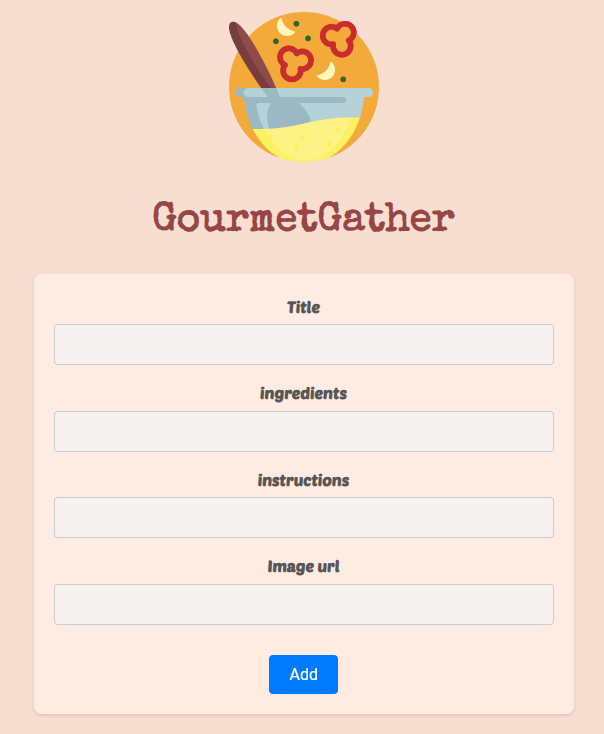
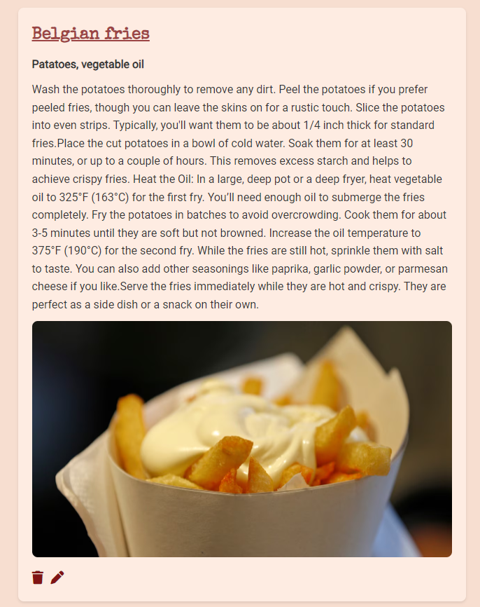

# Recipes

## Set up

### Front end

```bash
cd frontend
npm i
npm run dev
```

### Back end

```md
url = 'http://localhost:5002'
```

```bash
npm install -g nodemon
```

```bash
cd backend
npm i
npm run dev
```

## General info

> The objective of the project is to practice separation of concern in
> JavaScript.

## Screenshots




## Technologies

- JavaScript
- HTML5
- CSS3
- VSC code

## Setup

clone the repo and start using the To-Do list.

## Code Examples

```js
export const createRecipe = (recipe) => {

    const container = document.createElement('div');
    container.id = recipe._id;
    container.classList.add('recipe');


```

## Features

List of features ready and Todos for future development

-
-
-

To-do list:

-
-

## Status

Project is: _finished_

## Inspiration

## Contact

- [Emrah](https://github.com/emrahhko)
